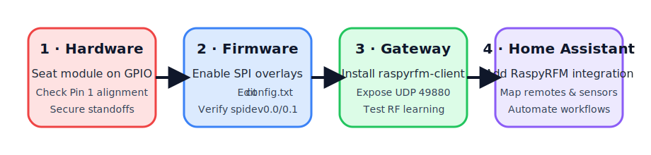
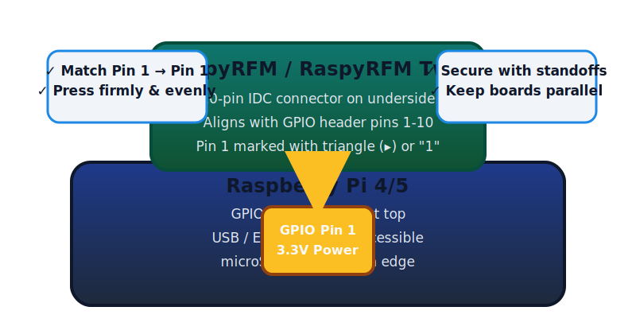

.. _raspyrfm-hardware-setup:

RaspyRFM Hardware Installation Guide
====================================

This tutorial walks through every step required to attach a Seegel Systeme
RaspyRFM or RaspyRFM Twin module to a Raspberry Pi and make the gateway
available to Home Assistant.  It covers three supported deployment options:

* a Raspberry Pi running **Home Assistant OS**,
* **Home Assistant Container** (Docker) on Raspberry Pi OS, and
* a classic **Raspberry Pi OS + raspyrfm-client gateway** that exposes
  Home Assistant to your 433/868&nbsp;MHz devices over the network.

The steps were assembled from the manufacturer's hardware notes and battle
tested against current Home Assistant builds so that you have a single
self-contained reference.  Follow the sections in order—each includes visual
checklists, shell commands, and verification tips.

         gateway, and Home Assistant configuration.
   :align: center

   Four high level milestones keep the installation on track.

Prerequisites
-------------

* Raspberry Pi 3B/3B+/4B (2&nbsp;GB RAM or higher recommended)
* RaspyRFM or RaspyRFM Twin add-on module
* 16&nbsp;GB (or larger) microSD card and reader
* Reliable 5&nbsp;V / 3&nbsp;A Raspberry Pi PSU
* Ethernet (preferred) or Wi-Fi with internet access
* Computer with Raspberry Pi Imager (Windows/macOS/Linux)
* Optional: USB-TTL serial console cable for first boot diagnostics

Bill of materials
-----------------

.. list-table:: Suggested hardware
   :widths: 22 78
   :header-rows: 1

   * - Component
     - Notes
   * - Seegel Systeme RaspyRFM II
     - Single radio (433&nbsp;MHz) board with 10-pin IDC connector and onboard
       SMA antenna jack.
   * - Seegel Systeme RaspyRFM Twin
     - Dual-radio daughter board.  Radio *A* ships tuned to 433&nbsp;MHz while
       radio *B* covers 868/915&nbsp;MHz.  Each radio has its own SMA connector
       and can be selected in software.
   * - 2×20 (40-pin) stacking header
     - Included with most kits.  Ensures the RaspyRFM module clears the Pi's
       USB/Ethernet connectors.
   * - 433&nbsp;MHz λ/4 whip antenna
     - Screw into the SMA connector marked ``A``.  Use 868&nbsp;MHz antenna on the
       connector marked ``B`` for the Twin module.
   * - Standoffs + screws
     - Keep the module parallel to the Raspberry Pi and avoid stress on the
       GPIO header.

Step 1 – Prepare the hardware
-----------------------------

1. **Disconnect power** from the Raspberry Pi.  The RaspyRFM must only be
   seated while the board is unpowered to avoid damaging the transceiver.
2. Identify **pin&nbsp;1** on both the Raspberry Pi and the RaspyRFM PCB.  On the
   Pi, it sits next to the corner closest to the microSD slot and is marked by
   a square pad.  The RaspyRFM uses an IDC connector with a small triangle or
   ``1`` silkscreen.
3. If you are installing the **Twin module**, fit the supplied 2×20 stacking
   header onto the Raspberry Pi first.  This raises the RaspyRFM so that both
   SMA connectors clear the Pi's USB/Ethernet ports.
4. Place the RaspyRFM over the GPIO header and press straight down until the
   IDC connector is fully seated.
5. Fasten the included standoffs to prevent vibration from working the board
   loose.

   Align pin&nbsp;1 on the RaspyRFM IDC connector with pin&nbsp;1 on the Raspberry Pi
   header before seating the board.

Step 2 – Antennas and jumpers
-----------------------------

* Screw the 433&nbsp;MHz antenna onto the SMA connector labelled ``A``.
* For the Twin module, attach the 868/915&nbsp;MHz antenna to connector ``B``.
* Confirm the slide switch next to radio ``A`` is in the **ASK/OOK** position
  when targeting 433&nbsp;MHz mains sockets and doorbells.  Move it to **FSK** for
  RFM69-based sensors.  Repeat for radio ``B`` if used.
* Leave the ``JP1``/``JP2`` jumpers at their factory position (``3V3``) unless
  you have a documented reason to power the radios from an external supply.

Step 3 – Enable SPI support
---------------------------

The RaspyRFM communicates via the Raspberry Pi's SPI0 controller, which must be
enabled in ``config.txt``:

1. Insert the microSD card into your computer.
2. Open the ``config.txt`` file on the boot partition and ensure the following
   lines are present (add them if necessary)::

      dtparam=spi=on
      dtoverlay=spi0-2cs

   The ``spi0-2cs`` overlay (or the Raspberry Pi OS default configuration with
   ``dtparam=spi=on`` alone) keeps both chip select lines enabled so the Twin
   module can expose two radios.

3. Save the file and safely eject the card.
4. Reinsert the microSD card into the Raspberry Pi and connect power.
5. After the Pi boots, confirm that ``/dev/spidev0.0`` and ``/dev/spidev0.1``
   exist::

      ls /dev/spidev0.*

   You should see both chip selects.  The Twin module uses ``spidev0.0`` for
   radio ``A`` (433&nbsp;MHz) and ``spidev0.1`` for radio ``B`` (868/915&nbsp;MHz).

Home Assistant OS workflow
--------------------------

The official Home Assistant OS images can drive the RaspyRFM hardware directly.
Carry out the following tasks in order.

1. **Flash the operating system**

   #. Start Raspberry Pi Imager and choose *Home Assistant OS* → *Raspberry Pi*
      → your board model.
   #. Select the microSD card and click the cog icon to pre-configure Wi-Fi
      (if needed), hostname, and SSH key.
   #. Write the image and eject the card when the imager finishes.

2. **First boot and onboarding**

   #. Insert the microSD card, connect Ethernet (recommended), and power up the
      Pi.
   #. Wait 20&nbsp;minutes for the initial provisioning, then open
      ``http://homeassistant.local:8123`` in a browser to complete the onboarding
      wizard.

3. **Expose the SPI interface to the supervisor**

   #. In the Home Assistant UI, install the *Terminal & SSH* add-on from the
      *Official add-ons* repository.
   #. Open the add-on web terminal and run ``login`` to drop into the host OS
      shell.
   #. Verify the boot flags::

         sed -n '1,120p' /mnt/boot/config.txt | grep -E 'dtparam=spi|dtoverlay'

      Adjust the file with ``nano`` if the SPI options are missing, then run
      ``ha host reboot``.

4. **Deploy the RaspyRFM gateway container**

   The Home Assistant supervisor runs an isolated operating system, so install
   the gateway as a Docker service that is managed by the host OS:

   #. From the host shell, create a dedicated directory::

         mkdir -p /usr/local/share/raspyrfm
         cd /usr/local/share/raspyrfm

   #. Create ``docker-compose.yml`` with the following content::

         version: '3.8'
         services:
           raspyfm-gateway:
             image: ghcr.io/raspyrfm/raspyrfm-gateway:latest
             container_name: raspyfm-gateway
             restart: unless-stopped
             network_mode: host
             devices:
               - /dev/spidev0.0
               - /dev/spidev0.1
             volumes:
               - ./config:/app/config
             environment:
               RASPYRFM_SPI_DEVICE_A: /dev/spidev0.0
               RASPYRFM_SPI_DEVICE_B: /dev/spidev0.1
               RASPYRFM_BIND_HOST: 0.0.0.0
               RASPYRFM_BIND_PORT: 49880

   #. Start the container::

         docker compose up -d

   #. Confirm the UDP listener is online::

         ss -uap | grep 49880

5. **Install the RaspyRFM custom integration**

   #. In Home Assistant, open *Settings → Devices & Services → Integrations* and
      click *+ Add Integration*.  Search for *"RaspyRFM"*—if it is not listed,
      install the custom component manually.
   #. To install the custom component, open the *Terminal & SSH* add-on and run::

         cd /config/custom_components
         mkdir -p raspyrfm
         curl -L https://github.com/raspyrfm/raspyrfm-client/archive/refs/heads/main.tar.gz \
          | tar -xz --strip-components=2 -C raspyrfm \
              raspyrfm-client-main/custom_components/raspyrfm

      Restart Home Assistant after the files are in place.
   #. Add the integration, enter the Raspberry Pi's IP address, keep the default
      UDP port (49880), and complete the config flow.

Home Assistant Container (Docker) workflow
------------------------------------------

When Home Assistant runs inside Docker on top of Raspberry Pi OS, the host OS
is in full control of the hardware.  The following ``docker-compose.yml``
snippet illustrates a combined setup where the Home Assistant container and the
RaspyRFM gateway share access to the SPI devices::

   version: '3.8'
   services:
     homeassistant:
       image: ghcr.io/home-assistant/raspberrypi4-homeassistant:stable
       container_name: homeassistant
       restart: unless-stopped
       network_mode: host
       privileged: true
       volumes:
         - /opt/homeassistant/config:/config
         - /etc/localtime:/etc/localtime:ro
       devices:
         - /dev/spidev0.0
         - /dev/spidev0.1

     raspyfm-gateway:
       image: ghcr.io/raspyrfm/raspyrfm-gateway:latest
       container_name: raspyfm-gateway
       restart: unless-stopped
       network_mode: host
       depends_on:
         - homeassistant
       devices:
         - /dev/spidev0.0
         - /dev/spidev0.1
       environment:
         RASPYRFM_SPI_DEVICE_A: /dev/spidev0.0
         RASPYRFM_SPI_DEVICE_B: /dev/spidev0.1
       volumes:
         - /opt/raspyrfm/config:/app/config

Bring the stack online with ``docker compose up -d``.  Confirm that the custom
integration exists in ``/opt/homeassistant/config/custom_components/raspyrfm``
(see the previous section for installation steps).  The integration discovers
and communicates with the gateway through the host network.

.. figure:: _static/raspyrfm-ha-topology.svg
   :alt: Diagram showing how Home Assistant, the RaspyRFM gateway, and RF
         devices exchange data.
   :align: center

   Home Assistant talks to the RaspyRFM gateway over UDP while the gateway
   forwards packets to the 433/868&nbsp;MHz radios via SPI.

Raspberry Pi OS gateway workflow
--------------------------------

If you prefer to keep Home Assistant off the hardware that drives the radios,
turn the Raspberry Pi into a dedicated RaspyRFM gateway and let Home Assistant
communicate over the network.

1. Flash Raspberry Pi OS Lite (64-bit), boot the Pi, and apply system updates::

      sudo apt update && sudo apt full-upgrade -y
      sudo raspi-config nonint do_spi 0

2. Install dependencies for the ``raspyrfm-client`` gateway::

      sudo apt install -y python3 python3-venv git
      sudo useradd --system --create-home --home-dir /var/lib/raspyrfm raspyfm

3. Provision a virtual environment and fetch the client::

      sudo -u raspyfm python3 -m venv /var/lib/raspyrfm/venv
      sudo -u raspyfm /var/lib/raspyrfm/venv/bin/pip install --upgrade pip
      sudo -u raspyfm /var/lib/raspyrfm/venv/bin/pip install raspyrfm-client

4. Create a systemd unit in ``/etc/systemd/system/raspyrfm-gateway.service``::

      [Unit]
      Description=RaspyRFM UDP gateway
      After=network-online.target
      Wants=network-online.target

      [Service]
      Type=simple
      User=raspyfm
      Group=raspyfm
      WorkingDirectory=/var/lib/raspyrfm
      ExecStart=/var/lib/raspyrfm/venv/bin/python -m raspyrfm_client.connair \
        --spi-device-a /dev/spidev0.0 --spi-device-b /dev/spidev0.1 \
        --listen 0.0.0.0 --port 49880
      Restart=on-failure

      [Install]
      WantedBy=multi-user.target

   Enable and start the service::

      sudo systemctl daemon-reload
      sudo systemctl enable --now raspyrfm-gateway

5. Point your Home Assistant instance (running elsewhere on the network) to
   the Raspberry Pi gateway via *Settings → Devices & Services → RaspyRFM*.

Twin module radio selection
---------------------------

The ``raspyrfm-client`` library automatically enumerates both radios exposed by
the Twin module.  Within Home Assistant the radios appear as separate gateways
(``A`` and ``B``).  Assign devices to the radio that matches their frequency:

* 433&nbsp;MHz wall switches, weather stations, and contact sensors → **Radio A**
* 868&nbsp;MHz heating thermostats and alarm system accessories → **Radio B**

Use the RaspyRFM panel to run two consecutive learning sessions—one per radio—
so that codes do not overlap.

Verification checklist
----------------------

* ``ls /dev/spidev0.*`` lists two chip select devices on the Raspberry Pi.
* ``docker ps`` (or ``systemctl status raspyrfm-gateway``) reports a running
  gateway with an open UDP socket on port 49880.
* The Home Assistant integration shows the gateway as *Connected* and the
  RaspyRFM panel lists your captured signals.

Troubleshooting tips
--------------------

* **Gateway offline** – Check the host firewall.  UDP ports ``49880`` and
  ``49881`` must be reachable from Home Assistant.
* **Missing SPI device** – Reapply the ``dtparam=spi=on`` setting and double
  check that no other overlay claims SPI0.
* **Twin module 868&nbsp;MHz radio silent** – Confirm ``spidev0.1`` is listed in
  your container configuration.  Without it the gateway cannot reach radio
  ``B``.
* **Interference or poor range** – Use quality SMA antennas that match the
  operating frequency and keep them upright.  Avoid placing the Raspberry Pi in
  metal enclosures.

Next steps
----------

With the gateway online you can follow the :doc:`homeassistant_components`
chapter to learn new RF codes, build automations, and manage devices from the
RaspyRFM control panel.
