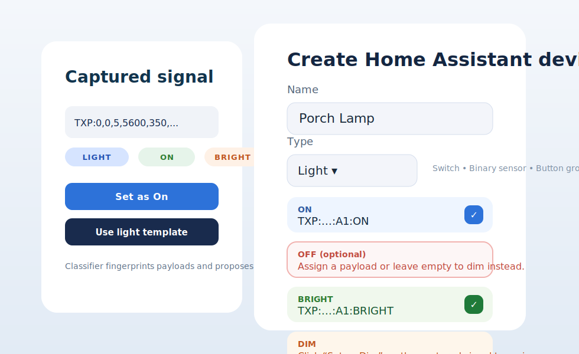
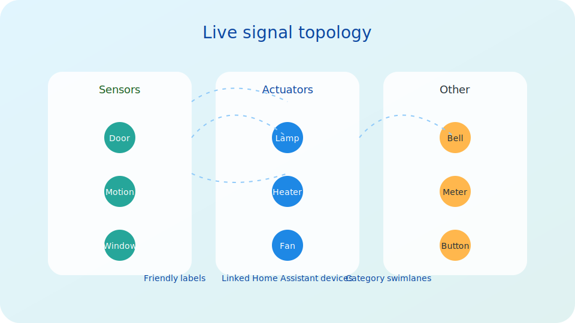
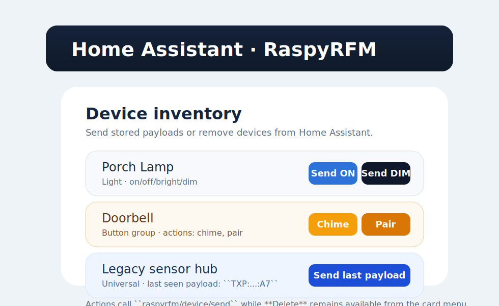

Home Assistant Experience
=========================

The RaspyRFM panel is bundled with the integration and appears in the
Home Assistant sidebar after you add a RaspyRFM config entry.  The panel
is implemented as the ``raspyrfm-panel`` LitElement component and talks to
Home Assistant exclusively through the websocket commands documented in
:doc:`homeassistant_components`.

Control strip
-------------

A row of Material Web Components at the top of the panel exposes the
core learning controls:

* **Start learning** – calls ``raspyrfm/learning/start`` and resets the
  in-memory signal buffer.
* **Stop learning** – calls ``raspyrfm/learning/stop`` and closes the
  UDP listener created by the backend.
* **Refresh devices** – pulls the current device list via
  ``raspyrfm/devices/list`` and updates the entity cards without reloading
  the page.
* **Reload mapping** – refreshes the optional signal metadata with
  ``raspyrfm/signals/map/list``.  When the mapping API is unavailable the
  panel shows a non-blocking error banner.

Captured signals card
---------------------

Signals arriving through the learning pipeline are rendered inside the
*Captured signals* card.  Each entry displays the raw payload, timestamp,
source address, and action buttons that populate the device creation
form.

   Selecting **Set as ON/OFF/trigger** copies the payload into the
   relevant field of the *Create Home Assistant device* card.

Create Home Assistant device
----------------------------

The form on the right converts captured payloads into Home Assistant
entities.  When the type is set to ``switch`` the RaspyRFM backend expects
both ``on`` and ``off`` payloads; binary sensors accept a single
``trigger`` payload.  Submitting the form calls
``raspyrfm/device/create`` and automatically refreshes the device list and
signal mapping state.

Signal mapping workspace
------------------------

The mapping workspace turns the ``raspyrfm/signals/map/*`` websocket API
into an interactive editor.  Every payload is assigned to one of three
categories—``sensor``, ``actuator``, or ``other``—and can optionally link
back to stored devices.  The LitElement component keeps track of pending
changes and only persists them when you press **Save mapping**.

.. figure:: _static/raspyrfm-mapping-editor.svg
   :alt: Signal mapping editor with label and device associations
   :align: center
   :figwidth: 85%

Device inventory
----------------

Configured switches and binary sensors are listed in a dedicated card at
the bottom of the panel.  Each entry shows the stored payloads, exposes a
**Delete** button that triggers ``raspyrfm/device/delete``, and mirrors the
state of the Home Assistant entities created by the integration.

Styling
-------

The panel ships with custom CSS that adopts Home Assistant's typography
and card spacing while introducing rounded cards and subtle gradients for
signal groupings.  The stylesheet lives alongside the Sphinx theme
in ``docs/source/_static/raspyrfm.css`` and is referenced from the
Furo theme configuration so the GitHub Pages site mirrors the in-app
appearance.
